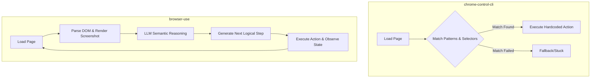

# Comparative Analysis: Rule-Based Solver vs. Agentic Browser Automation

This report compares **`chrome-control-cli`** (the current rule-based, Playwright-driven Android browser solver) with **`browser-use`** (the LLM-driven agentic browser automation framework) to address whether `browser-use` is more robust and how they differ in philosophy, execution, and suitability.

---

## 1. Architectural Philosophy

The two approaches solve the web automation problem using fundamentally different paradigms:

### `chrome-control-cli` (Rule-Based & Heuristic-Driven)
*   **How it works**: Uses pre-configured answer files (`quiz_answers.json`), static regex/substring match keys (`motivation`, `why did you choose`), and hardcoded CSS/Playwright locators (`button:has-text("Next")`).
*   **Decision Engine**: Hardcoded procedural JavaScript logic.
*   **Execution**: Extremely fast, lightweight, and local.

### `browser-use` (LLM Agentic & Vision-Augmented)
*   **How it works**: Parses the active DOM into a simplified interactive tree, feeds this text representation (and optionally visual screenshots) to an LLM, and lets the LLM decide which interactive element to target.
*   **Decision Engine**: Large Language Model reasoning (e.g., Gemini 1.5 Pro/Flash, Claude 3.5 Sonnet).
*   **Execution**: Multi-step reasoning loops that dynamically adapt to the layout of the page.

---

## 2. Robustness Comparison: Is `browser-use` more robust?

> [!IMPORTANT]  
> **Yes, `browser-use` is vastly more robust semantically and visually, but it comes at the cost of resource footprint, execution speed, and monetary cost.**

Here is how they compare across key dimensions of robustness:

| Feature/Scenarios | `chrome-control-cli` (Rule-Based) | `browser-use` (Agentic) | Winner |
| :--- | :--- | :--- | :--- |
| **Handling UI Layout Changes** | **Fragile**: A minor change in HTML structure, class names, or target elements will break hardcoded CSS selectors. | **Robust**: The LLM analyzes the page's semantics; class changes or structure shifts do not affect its ability to find the element. | **browser-use** |
| **Copywriting & Label Changes** | **Fragile**: If a "Next" button is renamed to "Proceed" or "Submit", the selector may fail unless explicitly added to the fallback array. | **Robust**: The LLM understands that "Next", "Proceed", and "Go" all represent the same logical intent. | **browser-use** |
| **New/Unseen Questions** | **Fails**: Cannot solve questions not covered by exact keys in `surveyAnswers` or `quiz_answers.json`. | **Succeeds**: Can read the new question, reason through options, and answer dynamically using its parametric knowledge. | **browser-use** |
| **Error Self-Healing** | **Limited**: Relies on basic script retries or generic bounding-box mouse click fallbacks. | **High**: If an action fails to change the page state, the LLM notices the state did not change and tries a different strategy. | **browser-use** |
| **Execution Speed** | **Instant**: Runs immediately (milliseconds per step). | **Slow**: Requires 1–5 seconds per step for LLM API round-trips. | **chrome-control-cli** |
| **Operational Cost** | **Free**: Runs entirely local with zero API overhead. | **Variable**: Incurs LLM token API costs for every page step. | **chrome-control-cli** |

---

## 3. Platform & Context Fit (Termux / Android / ADB)

Given that your workspace operates inside **Termux on Android** (`/data/data/com.termux/files/home/chrome-control`) controlling Chrome via ADB forwarding (`localabstract:chrome_devtools_remote`):

*   **`chrome-control-cli` is perfectly optimized for Android/ADB**:
    *   It contains tailored logic (`wakeChromeAndForward`) using ADB shell commands to launch Chrome.
    *   It uses `Playwright-Core` over CDP which has a tiny package size, critical for Termux environments.
    *   It is written in Node.js, which runs natively and efficiently on Termux without heavy Python environments.
*   **`browser-use` is heavy for mobile/Termux**:
    *   It is written in Python, requiring a complex virtualenv, `uv`, and heavy dependencies (like LangChain, Playwright Python, Pydantic).
    *   Running high-resolution screenshot analysis and complex agent loops directly inside Termux can lead to performance bottlenecks or memory constraints.
    *   While you can point `browser-use`'s browser instance to a remote CDP websocket (your forwarded ADB port `9222`), it requires custom-written connector scripts to match the seamless device-waking capability of `chrome-control-cli`.

---

## 4. Key Takeaways & Recommendations

1.  **When to stick with `chrome-control-cli`**:
    *   If your target pages (e.g., specific Test IO onboarding courses/surveys) have a **known, stable structure**.
    *   If you need **zero-cost, extremely fast executions** directly on a mobile/Termux environment.
    *   If the survey responses and quiz answers are static and can be pre-populated.

2.  **When to migrate to/integrate `browser-use`**:
    *   If you want to solve **arbitrary new courses/quizzes** without constantly updating `quiz_answers.json`.
    *   If the target platform changes its design, layout, or button identifiers frequently.
    *   If you are running the runner on a robust host machine (e.g., laptop/PC) rather than directly inside a constrained Termux container.

3.  **Hybrid Approach (Best of Both Worlds)**:
    *   Use `chrome-control-cli` as the lightweight **executor and device manager** (waking up Chrome, setting up ADB, handling device touches).
    *   Introduce a tiny microservice or local Python helper running `browser-use` to act as a **fallback solver** only when the rule-based matcher fails.
