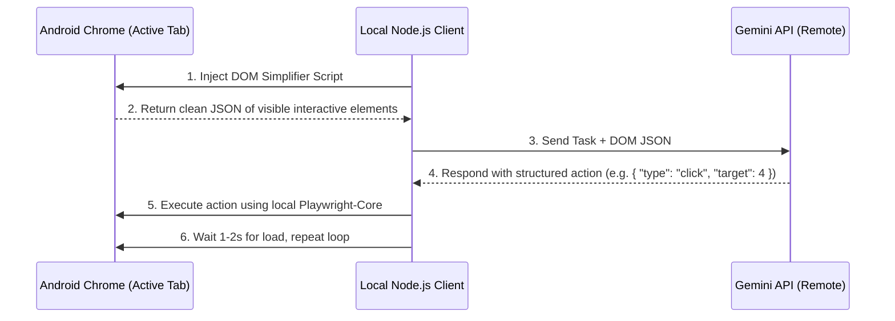

# Design Blueprint: Lightweight Agentic Browser Automation for Termux

This blueprint presents a highly optimized, **Termux-compatible architecture** that clones the semantic robustness of `browser-use` without the memory-intensive Python compilation that causes Out of Memory (OOM) terminal crashes on Android.

---

## 1. Why `browser-use` Crashes on Termux

Android imposes strict RAM boundaries (typically 512MB to 1.5GB per process) on background apps like Termux.
* **The Culprit**: `browser-use` relies on heavy Python packages (such as `pydantic-core` and `cryptography` which compile native Rust extensions during install, and `pillow`/`lxml` which compile C extensions). 
* **The Result**: Building these wheels or running their heavy Python orchestration (LangChain, asyncio managers, multi-threaded video recorders) immediately triggers Android's Low Memory Killer (LMK), crashing the Termux terminal.

---

## 2. The Solution: "Termux-Friendly Agent" Architecture

To achieve the same robustness (LLM-guided actions, self-healing, semantic understanding) without the crash risk, we separate the **Executor** (local, ultra-lightweight) from the **Reasoner** (remote cloud API):



### Key Advantages of this Architecture
1. **Zero Compilation**: Relies solely on native JavaScript (`playwright-core`) which is already installed and runs perfectly in Node.js on Termux.
2. **Extremely Low Memory**: Node.js uses V8's highly optimized engine, consuming under 60MB of RAM—well within Android's thresholds.
3. **Robustness Cloning**: The LLM handles the complex reasoning, semantic matching, and recovery, exactly like `browser-use`.

---

## 3. Core Implementation Modules

We can implement this system using three simple modules.

### Module 1: The DOM Simplifier (Client-side Injection)
This script is injected into the active browser page to identify and extract only elements that a user can interact with, assigning each a sequential index.

```javascript
// Injected into the page via page.evaluate()
function getInteractiveElements() {
    const interactiveTags = ['button', 'input', 'select', 'textarea', 'a', '[role="button"]', '[role="checkbox"]', '[role="radio"]'];
    const elements = Array.from(document.querySelectorAll(interactiveTags.join(', ')));
    
    return elements
        .filter(el => {
            // Filter out hidden/invisible elements
            const rect = el.getBoundingClientRect();
            const style = window.getComputedStyle(el);
            return rect.width > 0 && 
                   rect.height > 0 && 
                   style.display !== 'none' && 
                   style.visibility !== 'hidden' && 
                   style.opacity !== '0';
        })
        .map((el, idx) => {
            // Generate a simple, stable selector or fallback XPath
            const xpath = getXPath(el);
            return {
                id: idx,
                tag: el.tagName.toLowerCase(),
                text: el.innerText.trim() || el.placeholder || el.value || el.ariaLabel || '',
                type: el.type || '',
                xpath: xpath
            };
        });
}

function getXPath(element) {
    if (element.id) return `//*[@id="${element.id}"]`;
    const paths = [];
    for (; element && element.nodeType === 1; element = element.parentNode) {
        let index = 0;
        for (let sibling = element.previousSibling; sibling; sibling = sibling.previousSibling) {
            if (sibling.nodeType === Node.DOCUMENT_TYPE_NODE) continue;
            if (sibling.nodeName === element.nodeName) ++index;
        }
        const tagName = element.nodeName.toLowerCase();
        const pathIndex = (index ? `[${index + 1}]` : '');
        paths.unshift(`${tagName}${pathIndex}`);
    }
    return paths.length ? `/${paths.join('/')}` : null;
}
```

### Module 2: The LLM Prompt (The Brain)
We format the extracted elements as a JSON array and ask the LLM to choose the next action. 

```markdown
You are a web automation agent. Your task is to: "{{TASK}}"
Current Page URL: "{{URL}}"

Here are the interactive elements currently visible on the screen:
{{ELEMENTS_JSON}}

Analyze the elements. Which element should be acted upon next to accomplish the task?
Respond ONLY with a JSON object in this format:
{
  "reasoning": "Brief explanation of why you chose this action",
  "action": "click" | "type" | "select" | "finish",
  "target_id": 4, // The 'id' of the chosen element
  "value": "text to type or option to select if applicable"
}
```

### Module 3: The Local Executor (The Body)
A simple Node.js wrapper that hooks into your existing `playwright-core` and sends the network requests to the Gemini API.

```javascript
const { chromium } = require('playwright-core');
const axios = require('axios'); // For remote API requests

async function runAgent(task) {
    // 1. Connect to Android Chrome via your existing ADB CDP bridge
    const browser = await chromium.connectOverCDP('http://localhost:9222');
    const page = (await browser.contexts()[0].pages())[0];
    
    let step = 1;
    while (step < 20) {
        console.log(`\n=== Step ${step} ===`);
        
        // 2. Extract DOM interactive elements
        const elements = await page.evaluate(getInteractiveElements);
        
        // 3. Request next action from Gemini
        const geminiResponse = await getGeminiAction(task, page.url(), elements);
        console.log("Decision:", geminiResponse.reasoning);
        
        if (geminiResponse.action === 'finish') {
            console.log("Task completed successfully!");
            break;
        }
        
        // 4. Resolve the target element and execute action
        const targetElement = elements.find(el => el.id === geminiResponse.target_id);
        if (!targetElement) {
            console.error("Error: Chosen element ID not found in current DOM!");
            continue;
        }
        
        const locator = page.locator(`xpath=${targetElement.xpath}`);
        if (geminiResponse.action === 'click') {
            await locator.click();
        } else if (geminiResponse.action === 'type') {
            await locator.fill(geminiResponse.value);
        }
        
        // 5. Stabilize page
        await new Promise(r => setTimeout(r, 2000));
        step++;
    }
}
```

---

## 4. Next Steps for Implementation

To build this lightweight agent on your device:
1. We can write a lightweight Javascript CLI script named `termux_agent.js` inside `/data/data/com.termux/files/home/chrome-control`.
2. It will consume the **Gemini API** key directly through your standard `GEMINI_API_KEY` environment variable.
3. It will require zero compilation and run seamlessly under **60MB of RAM**, giving you the robust intelligence of `browser-use` without any risk of crashing your terminal.
